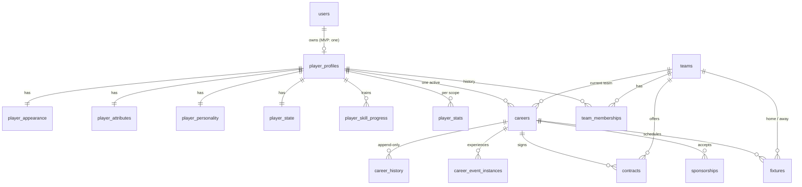
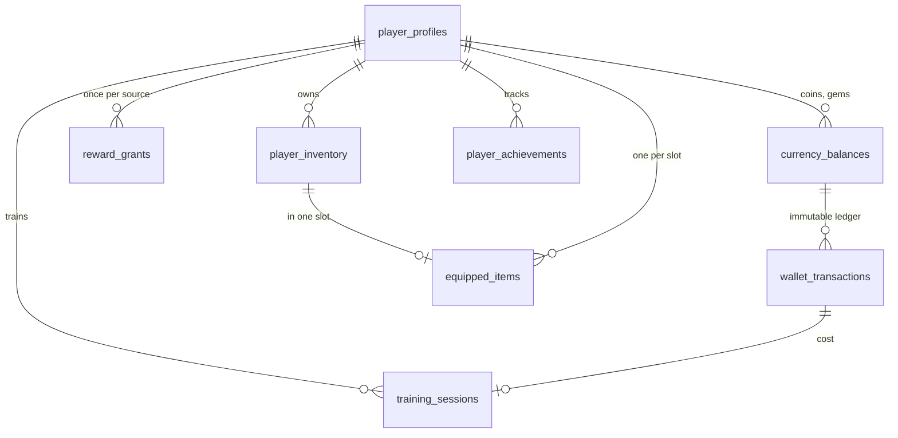
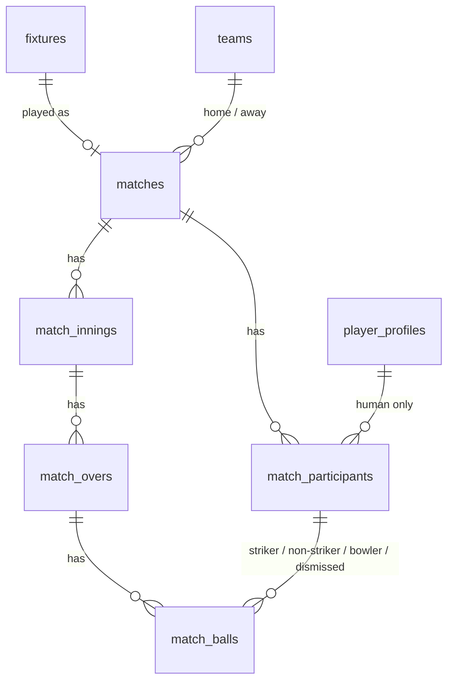

# Relationships

Split into three domain diagrams for readability. `||--o{` is one-to-many, `||--||` one-to-one.

## Identity, player and career

## Economy, inventory and progression

## Matches

`match_balls` carries composite foreign keys `(innings_id, match_id)`, `(over_id, innings_id)` and `(match_id, <participant>)`, so a ball can only reference an over, innings and participants of its own match.

## Delete behaviour

| Relationship                                                                                                         | Rule     | Why                                                                                |
| -------------------------------------------------------------------------------------------------------------------- | -------- | ---------------------------------------------------------------------------------- |
| `users` -> `player_profiles`                                                                                         | RESTRICT | Deleting a user must never erase the player or its economy history                 |
| `player_profiles` -> appearance, attributes, personality, state, skill progress                                      | CASCADE  | Pure 1:1 extension rows with no independent value                                  |
| `player_profiles` -> careers, stats, memberships, balances, inventory, training, rewards, achievements, participants | RESTRICT | History and audit data; removal only through an explicit account-deletion workflow |
| `careers` -> history, event instances, contracts, sponsorships                                                       | RESTRICT | Career history is retained                                                         |
| `currency_balances` -> `wallet_transactions`                                                                         | RESTRICT | The ledger outlives everything that could reference it                             |
| `teams` -> careers, contracts, fixtures, matches, memberships                                                        | RESTRICT | Teams are deactivated (`active=false`), never deleted                              |
| `matches` -> participants, innings; `innings` -> overs -> balls                                                      | RESTRICT | Completed match history is retained                                                |
| `player_inventory` -> `equipped_items`                                                                               | CASCADE  | Equipped rows are derived state; items are retired via `status`, not deleted       |
| `wallet_transactions` <- `training_sessions.wallet_transaction_id`                                                   | RESTRICT | Cost link stays valid                                                              |

There is no `SET NULL` anywhere: nothing in this model is legitimately orphaned.

## Account deletion (future workflow)

`UserRepository.changeStatus(id, 'deleted')` soft-deletes (sets `deleted_at`, terminal). A later legal-retention module can anonymise `player_profiles.display_name` and `match_participants.display_name_snapshot` in place while keeping ledger and match rows intact. Hard deletion is intentionally impossible through normal foreign keys.
