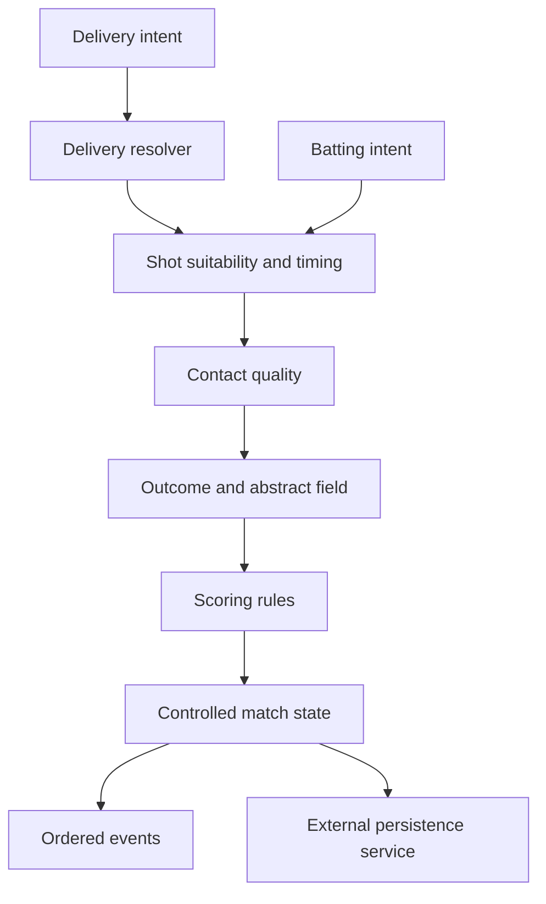

# Architecture

`bowling/`, `batting/` and `outcomes/` calculate execution. `rules/scoring.ts` applies legal balls, extras, batters and scorecards without drawing randomness. `engine/` controls lifecycle and emits events. `simulation/` chooses intents. `replay/` replays commands. `stats/` derives presentation and performance.

Internal state uses controlled mutation. External snapshots/results/replays are detached copies, so caller mutation never changes authority. `cursor()` copies only the small orchestration view; simulations avoid copying a growing history on every step. No async work occurs in the engine.
